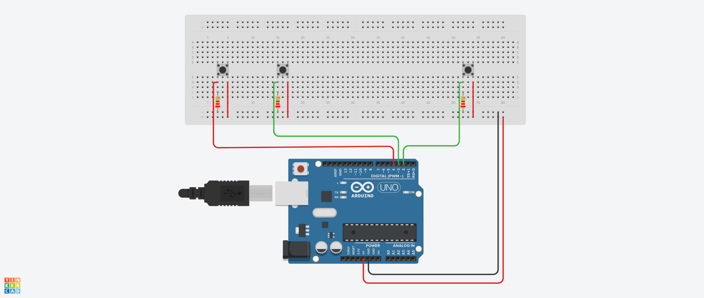

# Arduino Game Pad

## Contents

- [Building](#building)
- [Components](#components)
- [The Circuit](#the-circuit)
- [How To Use](#how-to-use)

## Building

For this project, I used the PlatformIO CLI and VS Code extension as opposed to the Arduino IDE. While the build process is just about the same, PlatformIO comes with some commands to simplify it. In other words, there are a few ways you can go about building this project.

### PlatformIO

If you have PlatformIO installed, all you need to do to compile the code is run `make`, and to upload, `make clean`. You could also just use the buttons PlatformIO provides, but I prefer using a Makefile.

### Arduino IDE

In the Arduino IDE, simply change main.cpp to main.ino and open it in the Arduino IDE. Then you can just build and upload as you usually would.

## Components

To make this gamepad, you really don't need many components other than obviously an Arduino board, some push buttons, and some resistors.
The required components and their quantities can be found in the below table:
|Name |Quantity|Component |
|--------------------|--------|---------------|
|U1 |1 | Arduino Uno R3|
|SJump, SLeft, SRight|3 | Pushbutton |
|R1, R2, R3 |3 |220 Ω Resistor |

## The Circuit

The circuit for this gamepad is very simple and cheap to make.
The diagram can be found below:


Or for a circuit schematic, check out [docs/Diagram.pdf](docs/Diagram.pdf).

## How To Use

When a button on the gamepad is pressed, the Arduino will send data through the serial port which can also be read from on your PC. This is where you come in. While this gamepad was intended as a fun weekend project to experiment with Unity, you can use this for all sorts of projects.

Here is an example of reading input from the gamepad:

```python
import serial

port = serial.Serial(
    port="COM7",
    baudrate=9600,
    bytesize=8,
    timeout=5,
    stopbits=serial.STOPBITS_ONE
)

while True:
    if port.in_waiting > 0:
        data = port.read(size=1).decode("Ascii")

        if data == "R":
            print("Moving Right!")
        elif data == "L":
            print("Moving Left!")
        elif data == "J":
            print("Jump!!!")

```
